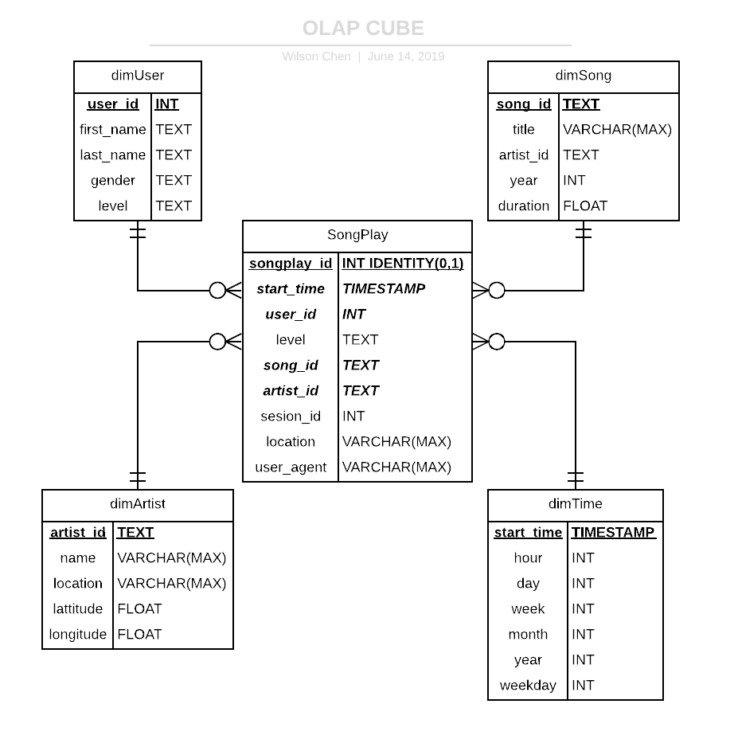

# Data Lake and OLAP CUBE on AWS EMR, Athena and S3
_________
Sparkify, a startup, wants to analyze the data they've been collecting on songs and user activity on their new music streaming app. 
The goal of this project is to create a data warehouse and the OLAP CUBE(ROLAP) using Spark on AWS EMR that allow analytics team to optimize queries on songplay analysis.

## DataSets
_________
There are two data sets. Both of them are in S3.
Paths to each data set are as follow:
- **Song data:** `s3://udacity-dend/song_data`
- **Log data:** `s3://udacity-dend/log_data`

First one is Song Data, each file is in JSON format and contains metadata about a song and the artist of that song. 
`{"num_songs": 1, "artist_id": "ARJIE2Y1187B994AB7", "artist_latitude": null, "artist_longitude": null, "artist_location": "", "artist_name": "Line Renaud", "song_id": "SOUPIRU12A6D4FA1E1", "title": "Der Kleine Dompfaff", "duration": 152.92036, "year": 0}`

Second one is activity log data. Each file is in in JSON format as well.

## Data Model
_________

